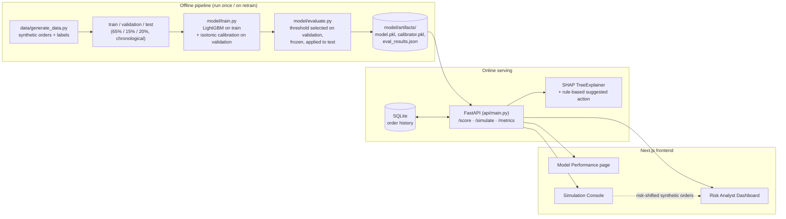

# RiskGuard — AI Risk Manager (Razorpay Buildathon, Track 02)

Every returned e-commerce order costs money twice — once in fulfillment, once in reverse
logistics — and with COD still dominant in Indian e-commerce, that cost is locked in before the
courier even leaves the warehouse. RiskGuard predicts, at the moment an order is placed, a
calibrated probability that it will be returned, using the order's category, payment mode, value,
delivery tier, and the customer's own purchase history, then recommends whether to accept it
normally or flag it for verification — using a cost-based threshold, not an arbitrary 0.5 cutoff.

**RiskGuard recommends; it never autonomously blocks, denies, or refunds an order. Every action
requires a human in the loop.**

**Track 02 brief:** *"Build a working detector, verifier, or auto-responder for one class of
loss, with measured precision and recall on a held-out test set."* Judging bar: *"Honest metrics
including false-positive cost. Strictly defense-only."* RiskGuard covers all three roles: the
calibrated model is the **detector**, the rule-based suggested action is the **responder**, and
the logged analyst decision (confirm / flag, see "The verifier" section below) is the
**verifier**.

There is no policy engine, no approval workflow, and no execution path — including the rule-based
"suggested action" in the dashboard, which is a printed suggestion, not a triggered action.

---

## At a glance

- **Test ROC-AUC 0.812** against a Bayes-optimal ceiling of 0.818 — the model captures ~98% of the
  ranking signal any model could recover from this data (measured from 0.5, the coin-flip AUC), and
  its precision/recall (0.579 / 0.516) sit within 0.01 of what even a perfect model gets at the
  same flag rate.
- **Saves ₹43,521 per 1,000 orders vs. flagging nothing, and ₹111,744 per 1,000 vs. flagging
  everything** — at a cost-optimal threshold computed from real friction/return/review costs, not
  an arbitrary cutoff.
- **The threshold was almost picked dishonestly.** An early pass selected it against the same test
  set it then reported results on. Caught, fixed with a proper train/validation/test split — full
  story in "Methodology hardening" below.

The three lines above are the fast version. Full metrics, baselines, segment breakdowns, and
confidence intervals are in "Model performance" further down.

---

## Why Return-Risk Scorer

Of Track 02's four suggested sub-problems, this one has the cleanest ground-truth story
(return/no-return is an unambiguous supervised label), the clearest false-positive-cost tradeoff
(friction cost on a flagged legitimate order vs. reverse-logistics cost on a missed return), and
calibration is directly checkable — if the model says "70% return probability," we can verify
~70% of orders scored in that band actually returned, on held-out data.

## Architecture


```mermaid
flowchart LR
    subgraph Offline["Offline pipeline (run once / on retrain)"]
        GEN["data/generate_data.py<br/>synthetic orders + labels"] --> SPLIT["train / validation / test<br/>(65% / 15% / 20%, chronological)"]
        SPLIT --> TRAIN["model/train.py<br/>LightGBM on train<br/>+ isotonic calibration on validation"]
        TRAIN --> EVAL["model/evaluate.py<br/>threshold selected on validation,<br/>frozen, applied to test"]
        EVAL --> ARTIFACTS[("model/artifacts/<br/>model.pkl, calibrator.pkl,<br/>eval_results.json")]
    end

    subgraph Online["Online serving"]
        ARTIFACTS --> API["FastAPI (api/main.py)<br/>/score · /simulate · /metrics"]
        DB[("SQLite<br/>order history")] <--> API
        API --> SHAP["SHAP TreeExplainer<br/>+ rule-based suggested action"]
    end

    subgraph Frontend["Next.js frontend"]
        API --> PERF["Model Performance page"]
        API --> DASH["Risk Analyst Dashboard"]
        API --> SIM["Simulation Console"]
        SIM -.risk-shifted synthetic orders.-> DASH
    end
```

Two lean roles, no full e-commerce platform:

- **Risk Analyst Dashboard** — live-scored order feed (newest first), click-through SHAP
  explanations plus a rule-based suggested action, and a Model Performance page
  (precision/recall/F1 with bootstrap CIs, confusion matrix, ROC-AUC, PR curve, calibration curve +
  Brier/ECE, lift curve, segment breakdown, and the cost-based threshold analysis).
- **Simulation Console** — generates genuinely new synthetic orders (separate from train/test)
  and scores them live, with a risk-shift slider that skews the batch toward higher-risk
  conditions to make the demo visually dynamic. A batch keeps streaming into the dashboard feed
  even if you switch pages mid-batch.

```
riskguard/
├── features_core.py          # shared temporal-feature formulas (single source of truth)
├── tests/
│   ├── test_feature_parity.py              # formula guard: generator path == API path
│   ├── test_serving_store.py               # input guard: served features == training features; store, clock, stream
│   ├── test_simulate_batch_isolation.py    # same-batch orders never see each other; atomic commit
│   └── test_shap_calibration_consistency.py
├── data/
│   ├── generate_data.py       # synthetic order + label generator
│   └── processed/             # train.csv, validation.csv, test.csv
├── model/
│   ├── train.py                # LightGBM (train.csv) + isotonic calibration (validation.csv)
│   ├── evaluate.py             # leakage-safe threshold selection, metrics, CIs, lift, Brier/ECE
│   └── artifacts/              # model.pkl, calibrator.pkl, metadata.json, eval_results.json
├── api/
│   ├── main.py                  # FastAPI: /score, /simulate(/stream), /orders, /metrics, /decide, /decisions
│   ├── db.py                    # SQLite: order history + decisions, dataset clock, store migrations
│   ├── features.py              # thin wrapper around features_core.py for online scoring
│   ├── scoring.py                # model + calibrator + SHAP + rule-based recommendation
│   └── simulate_gen.py           # risk-shift-aware synthetic order generator
├── experiments/                   # standalone analyses, not wired into the product
│   ├── uci_transfer_check.py       # real-data transfer check + leak-check diagnostic
│   ├── http_score_parity_check.py  # real HTTP round-trip train/serve parity check
│   └── score_latency_benchmark.py  # POST /score p50/p95 latency
└── frontend/                     # Next.js 16 (App Router) dashboard
```

## Running it

**Backend** (Python 3.13+, from `riskguard/`):

```bash
python data/generate_data.py      # regenerate synthetic data (fixed seed, deterministic)
python model/train.py             # train on train.csv, calibrate on validation.csv
python model/evaluate.py          # select threshold on validation, report on test -> eval_results.json
python -m pytest                 # regression suite (tests/)
python -m uvicorn api.main:app --port 8000
```

The API auto-creates and seeds a SQLite store (`data/riskguard.db`) from all three processed CSVs
on first startup, so `/score` and `/simulate` have real customer history to compute features from.
Whenever the processed CSVs change (e.g. after re-running `data/generate_data.py`), the next startup
re-syncs the store's seeded history to them, keeping live orders and logged decisions. A store
created by an earlier version is upgraded in place (see "Methodology hardening", item 4).

**Frontend** (Node 20+, from `riskguard/frontend/`):

```bash
npm install
npm run dev      # http://localhost:3000
```

Set `NEXT_PUBLIC_API_BASE_URL` in `.env.local` if the API isn't on `localhost:8000`.

## The label-generation design (and an honest note on tuning it)

The synthetic label is deliberately multi-signal, non-monotonic, and noisy — never a single
dominant rule — so the model has to actually learn something and the reported metrics look like
a real, imperfect ML problem rather than a rigged demo:

- Category base rate × payment-mode multiplier, blended 78/22 with the customer's
  Bayesian-smoothed return history
- A non-monotonic order-value effect (risk peaks in the ~₹3,000 "impulse zone," not at the
  extremes)
- A pincode-tier × category interaction (tier-3 apparel/footwear runs hotter)
- An overall return-level scale (×1.10, see below)
- The label itself is a random draw from that probability — a 40%-risk order is returned 40% of
  the time — which is the irreducible noise that keeps any classifier well short of perfect

**Why the constants aren't the ones in the original track brief's example:** the first pass used
illustrative constants that, when actually measured (scoring the true generative probability
against the sampled label — the Bayes-optimal AUC ceiling for *any* classifier on this data), capped
out around 0.60–0.63 AUC — below what a real classifier should be able to defend. Rather than
quietly ship a weak model, we ran a systematic search over the same functional form for constants
that close the gap without inflating the overall return rate to an unrealistic level (naive
widening pushes it past 30%, implausible for a catalog that's mostly groceries/electronics). Those
constants landed at a held-out test AUC of ~0.70 and a 22% overall return rate — with the label
flips described next still in place.

**Second retune: removing the label flips.** Every label used to get a further 6% chance of being
flipped at random after the draw, added to cap achievable AUC. That double-counted noise: the draw
already stands in for everything the features can't see, and the flips turned about a fifth of all
recorded returns into pure coin-flips no model could predict — which is also why groceries showed a
12% return rate, several times what grocery returns actually run. With the flips removed and the
overall return level scaled ×1.10 so fashion keeps realistic COD-heavy rates, category rates are
footwear ~44%, apparel ~35%, beauty ~15%, home goods ~9%, electronics ~7%, groceries ~5%, ~19%
overall. The Bayes-optimal ceiling rose from 0.715 to 0.818 and the model from 0.706 to 0.812.
**The model did not get better — the problem stopped being artificially noisier than the process
it simulates.** At both settings the model captures essentially all the signal the data contains
(96% before, 98% now). Two alternatives were measured and rejected: rebalancing the classes to
50/50 leaves AUC unchanged (0.707) and only inflates precision if the *test* set is rebalanced too —
which means claiming a 70% footwear return rate; and a latent per-customer "serial returner" trait
widens the gap between model and ceiling without improving precision. These constants are locked;
do not retune them chasing a higher number.

## Methodology hardening

These issues surfaced in self-review passes after the system was first functionally complete, and
were fixed deliberately rather than left as buried caveats:

**1. Threshold-selection leakage.** The first pass swept the cost-optimal decision threshold
against the test set and then reported precision/recall on that same test set at that threshold —
letting the test set influence a modeling decision before being used to evaluate it. The fix: data
is now split chronologically into **train (65%) / validation (15%) / test (20%)**. The model
trains on `train`, isotonic calibration fits on `validation`, the cost-optimal threshold is
*selected* by sweeping `validation` only, and that threshold is *frozen* before ever touching
`test`. All reported precision/recall/F1/confusion-matrix numbers are test-set results at a
threshold the test set had zero influence over. Concretely, on the current data: selecting on test
would pick 0.222 — recall 0.678 and a test cost ₹7,330 lower than the honest pick, both flattering
precisely because the threshold was tuned to the set it's scored on; the validation-selected
threshold (0.276) gives precision/recall 0.579/0.516 at ₹202,690 on test — the number that would
actually hold up. The Model Performance page shows both steps explicitly —
"select on validation" then "apply blind to test" — as two side-by-side panels, not one hidden
number.

**2. Train/serve feature skew.** `data/generate_data.py` and the scoring API each used to
implement the same temporal-feature formulas (Bayesian-smoothed return rate, 30/90-day return
windows, purchase frequency, etc.) independently. Any drift between the two — a different prior,
a different cold-start default — would silently produce train/serve skew visible only in live
demo behavior, never in reported metrics. `features_core.py` is now the single implementation
both sides import; `tests/test_feature_parity.py` is a permanent regression guard against the two
call sites drifting apart again.

**3. Simulate-batch outcome visibility.** In production, a return outcome isn't known for days or
weeks. `/simulate` now snapshots each customer's *pre-existing* persisted history before scoring
a batch, scores every order in that batch against that frozen snapshot only, and defers all
database writes until the whole batch is scored — so two orders in the same batch for the same
customer never see each other's existence or outcome. Only *future* `/simulate` or `/score` calls
see a batch's orders as real history.

**4. Train/serve skew in the *inputs*, not the formulas.** Item 2 made the feature formulas
identical, but the serving store fed them different history. It was seeded from `train.csv` and
`test.csv` only — `validation.csv`, 15% of every customer's timeline, was silently missing, along
with 85 customers who only ordered in that window — and live orders were scored against the wall
clock while all seeded history ends in June 2024, so every returning customer looked ~2 years
dormant ("last order 915 days ago") with 30/90-day return windows that could never be non-zero.
Rebuilding the held-out test orders' features through the serving path gave different values for
1,415 of 2,437 of them. The measured accuracy impact was small (test AUC 0.810–0.811 under the
skewed inputs vs. 0.812 — this model leans on category, payment mode and return history rather than
recency), but the dashboard's customer profiles were wrong and the parity claim wasn't true end to
end. The store now seeds all three splits, live orders continue the dataset's own clock (placed
just after the latest order on record), and a store created by an earlier version is migrated in
place on startup. Seeded history also re-syncs automatically whenever the processed CSVs change, so
regenerating the data can't leave the store serving an old dataset's return history.
`tests/test_serving_store.py` rebuilds every held-out order's features through the
exact serving path and requires the values the model was evaluated on.

## Cold-start defaults (the exact answer to "what does a brand-new customer's first order get?")

Every history-dependent feature has a locked, explicit default for a customer's very first order —
stated here precisely because it's a near-certain panel question:

| Feature | Cold-start value | Why |
|---|---|---|
| `bayesian_return_rate` | 0.20 (prior mean: 2/(2+8)) | Bayesian-smoothed prior, not an undefined or trivially-separable value |
| `returns_last_30d` / `returns_last_90d` | 0 | No history exists yet |
| `order_value_vs_customer_avg` | 1.0 (neutral) | No prior average to compare against |
| `days_since_last_order` | -1 (sentinel) | An explicit "no prior order" flag, never an imputed fake recency |
| `customer_purchase_frequency` | 0.0 | No orders yet to compute a rate from |

These defaults live in exactly one place (`features_core.py`) and are exercised by
`tests/test_feature_parity.py`'s cold-start test, so this table is guaranteed to match the running
code, not just describe an earlier intention.

## The overfitting diagnosis (a genuine methodology story, not a footnote)

An earlier model configuration (500 trees, max_depth=7, 63 leaves) drove **train AUC to 0.96**
while **held-out test AUC collapsed to 0.66** — a textbook memorization signature on a ~7.9k-row
training set with a true signal ceiling of **0.715 AUC** on the earlier, noisier version of this
dataset (the Bayes-optimal ceiling: score the label generator's own ground-truth probability
against the sampled test-set labels — no classifier can beat this on this data, by construction).
The fix was to cut model capacity hard: 100 trees, max_depth=3, num_leaves=8, with meaningful L1/L2
regularization. On the current data that config gives train/validation/test AUC of
**0.814 / 0.815 / 0.812** — close together, which is the actual evidence the model learned signal
rather than noise, not just a better-looking single number.

## Model performance (held-out test set, 2,437 orders)

| Metric | Value |
|---|---|
| Bayes-optimal ceiling AUC (no classifier can beat this on this data) | 0.818 |
| ROC-AUC (LightGBM) | 0.812 [95% CI 0.789–0.833] |
| Share of achievable signal captured, (AUC − 0.5) / (ceiling − 0.5) | 0.981 |
| PR-AUC (average precision) | 0.575 |
| Brier score | 0.116 |
| Expected Calibration Error (ECE) | 0.029 |
| Positive rate | 19.5% |
| Cost-optimal threshold (selected on validation, applied to test) | 0.276 |
| Precision @ threshold | 0.579 [95% CI 0.534–0.625] |
| Recall @ threshold | 0.516 [95% CI 0.468–0.557] |
| F1 @ threshold | 0.546 [95% CI 0.505–0.584] |
| Bayes-optimal precision / recall, flagging the same 423 orders | 0.589 / 0.524 |

AUC, precision, recall, and F1 are reported as decimals throughout this document, the dashboard,
and `eval_results.json` — consistently, not mixed with percentage formatting for some and decimal
for others (positive rate, lift %, and cost deltas are population/cost statistics, not this
four-metric cluster, and stay as percentages).

95% confidence intervals are bootstrap estimates (1,000 resamples) — worth stating explicitly on
a ~2.4k-row test set, where point estimates alone understate real sampling uncertainty. At 0.812
against a 0.818 ceiling, the model captures ~98% of the achievable ranking signal: (0.812 − 0.5) /
(0.818 − 0.5). Dividing the raw AUCs would say 99%, but that ratio credits a coin flip (AUC 0.5)
with 61%.

**Why precision and recall sit in the 0.5s — and why that isn't headroom.** The same ceiling holds
at the operating point: flagging the same 423 test orders by the label generator's *true* return
probability — the most returns any model can expect to catch with 423 flags — gives precision
0.589 and recall 0.524, against the model's 0.579 and 0.516. Both numbers are capped by the data's
own irreducible noise (every label is a random draw from its true probability), not by the model.
Precision is also partly a choice: at a 0.5 threshold it would be 0.753, but recall would fall to
0.263 — the cost-optimal threshold trades that precision for catching twice the returns, because a
missed return costs 3.6x a false flag.

**Why PR-AUC alongside ROC-AUC:** ROC-AUC can look deceptively strong on an imbalanced problem
like this one (19.5% positive), since a low false-positive *rate* is easy to achieve once negatives
dominate the population. PR-AUC (average precision) summarizes the precision-recall curve the same
way ROC-AUC summarizes the ROC curve, and is the more informative single ranking-quality number
here — the full curve it's computed from is on the Model Performance page.

**Cost-based threshold:** default assumptions are ₹180 friction cost (false positive), ₹650 return
cost (false negative), and ₹50 review cost per flagged order (analyst time — flagging isn't free).
Return cost dominates, so the optimal threshold sits well below 0.5. All three costs are
adjustable live on the Model Performance page; the threshold recomputes instantly from the
already-fetched validation cost curve (no extra API round-trip), and the resulting test-set
confusion matrix and the baselines' costs update alongside it. The bootstrap CIs were computed at
the default-cost threshold, so the page shows them only at the default costs rather than next to
point estimates for a different threshold.

**Headline number:** per 1,000 orders, at default costs, the model saves **₹43,521 vs. screening
nothing** and **₹111,744 vs. screening every order**. This is computed directly from the two
boundary cases (flag-nothing cost = all actual returns become false negatives; flag-everything
cost = all legitimate orders become false positives) against the model's actual cost at its
validation-selected threshold — normalized per 1,000 orders for readability, displayed as the
first thing on the Model Performance page.

**Lift/gains:** reviewing just the riskiest 10% of orders (by model score) catches ~36% of all
actual returns in the test set — ~3.6x better than reviewing a random 10%.

### Baselines: a floor to go with the ceiling

| Approach | AUC | Precision | Recall | Cost on test |
|---|---|---|---|---|
| Heuristic rule (flag if COD + footwear/apparel) | — (binary rule) | 0.619 | 0.328 | ₹237,230 |
| Logistic regression (identical features, same split) | 0.797 | ranked score | ranked score | — |
| **LightGBM (this model)** | **0.812** | **0.579** | **0.516** | **₹202,690** |

Two honest findings worth stating plainly rather than glossing over:

- The heuristic has *higher* precision than the model (0.619 vs. 0.579) but far lower recall
  (0.328 vs. 0.516). Because return cost (₹650) dwarfs friction cost (₹180), the model's extra
  recall is worth more than the heuristic's extra precision — the heuristic costs **~17% more**
  overall (₹237,230 vs. ₹202,690) despite looking "more accurate" on precision alone. The
  Model Performance page recomputes both costs live as the cost sliders move.
- Logistic regression on the *identical* one-hot feature set comes close: 0.797 vs. LightGBM's
  0.812, inside LightGBM's own 95% CI (0.789–0.833). This isn't a weakness to hide — it's evidence
  the achievable signal in this data is mostly linear/multiplicative (consistent with how the label
  generator itself combines category and payment effects), with LightGBM's small edge coming from
  the non-linear order-value effect and the interactions. Where LightGBM clearly earns its place is
  per-order SHAP explainability and native categorical handling, not raw ranking power.

### Segment-level performance (known limitation, stated honestly)

Global metrics average over segments the model treats very differently. By product category, the
model ranks best within **footwear (AUC 0.78)** and **apparel (0.75)** — the two highest-return
categories — and more weakly, though clearly above random, within beauty (0.66), electronics
accessories (0.63), groceries (0.63), and home goods (0.62). More important for how it's used: **at
the cost-optimal threshold the model only ever flags footwear and apparel orders** (267 and 156 of
its 423 flags). No beauty, electronics, grocery, or home-goods order clears the threshold — at
return rates of 5–17%, a flag there doesn't pay for its friction and review cost. So in practice
RiskGuard answers "which fashion orders should we verify?", and its edge over the COD-fashion
heuristic is picking *which* ones, including prepaid orders the rule ignores — worth ~17% of total
cost. By payment mode, COD is strongest (0.85); by tenure, new and returning customers score
similarly (0.84 / 0.81), though the "new customer" slice is only 114 test-set orders — read that
number with appropriate caution. Full breakdown (with sample sizes, flag counts, and a low-sample
flag below n=100) is on the Model Performance page. **Practical implication: returns in low-return
categories are accepted as the cheaper risk rather than screened. If the cost assumptions change
enough to push the threshold down, those categories start getting flagged — where the model's
ranking is weaker.**

### Additional robustness probes

- **Threshold stability:** bootstrap-resampling the validation set 1,000 times and re-selecting
  the cost-optimal threshold each time gives a median of 0.276 (matching the point estimate) and an
  IQR of **[0.246, 0.340]** — the upper quartile sits ~23% above the median. (Adopting bagged
  isotonic calibration had tightened this spread on the earlier dataset, from an upper quartile
  ~65% above the median to ~26%.) A different slice of validation data could still plausibly have
  selected a somewhat different threshold. This is a genuine limitation of tuning a decision
  threshold on a ~1,800-row validation set, not a flaw in the leakage-safe method itself, and it's
  exactly the kind of caveat "honest metrics" is supposed to surface.
- **Calibration under the demo's risk-shift slider:** the Simulation Console's risk-shift slider
  changes the population the model sees. `model/evaluate.py` probes it directly: cold-start orders
  drawn exactly as the slider draws them, labeled by the locked generator, scored by the live model.
  Two details keep the comparison honest. The baseline is the same probe at shift=0, not the test
  set's ECE (a different population and sample size). And each figure is the median of 5
  independent 1,500-order probes, because a single probe's ECE swings by about ±0.01 on its own.
  Median ECE rises from **0.033** at shift=0 to **0.039** at shift=0.7 and **0.043** at the slider's
  maximum: a mild, monotone degradation (~1.2x and ~1.3x), with the probe ranges overlapping. If a
  judge cranks the slider live and asks about calibration, the honest answer is "it degrades a
  little under a heavily skewed population, more the further you push it — expected, since the
  model wasn't calibrated for that population."
- **`/score` latency:** p50 ~28ms, p95 ~30ms over 150 varied calls
  (`experiments/score_latency_benchmark.py`, re-measured after the serving fixes, which cost well
  under 1ms) — SHAP computation is not a bottleneck at this model size.
- **No seasonal / concept-drift signal.** The simulation window is a flat 6 months (Jan–Jun 2024)
  with no seasonal demand or return-rate shifts built in — a model trained on Jan–Apr data is never
  tested against a population that looks meaningfully different, e.g. a festive-season spike in
  apparel returns (Diwali, end-of-season sales). Real deployments would need periodic
  recalibration or drift monitoring that this buildathon-scale simulation doesn't model or test.

## Real-data transfer sanity check (optional, exploratory)

Everything above is evaluated on self-generated synthetic data — a fair critique is "you proved
the model can recover the process you wrote." `experiments/uci_transfer_check.py` is a standalone
check of whether the same *feature shape* (order value, customer purchase history, recency, a
categorical interaction) carries real signal on the public **UCI Online Retail** dataset (Dec
2010–Dec 2011, ~4,300 customers, ~18.5k invoices), using a customer's cancellation invoice within
30 days of a purchase as an approximate return proxy (this dataset has no explicit return flag).
Same chronological-split discipline as the main model, same low-capacity LightGBM config.

**The first result (0.78 test AUC) didn't survive scrutiny.** The 30-day-window proxy label
clusters — 61% of positive-labeled invoices have another positive-labeled invoice from the *same
customer* within 15 days — and the first version's `customer_prior_cancel_rate` counted every past
invoice's label, including labels whose 30-day window was still open at order time. That reads the
future: one cancellation at T+10 days labels both a past invoice at T−5 days and the current one.
Counting only labels actually known at order time (past invoices whose window has closed) drops
test AUC from 0.78 to **0.73**, so ~0.06 of the headline came from the future. The script still
computes the leaky variant, clearly labeled, so the size of the leak stays visible. What remains is
real signal: **order-level features alone — order value, item count, unit price, and country —
score 0.63 test AUC**, and causal customer history adds ~0.10 on top. Both honest numbers are
meaningfully above 0.5 on genuine real-world data, which is the actual point of running this check;
the order-level one is the most structurally comparable to what the main synthetic model's order
fields contribute.

This script is intentionally **not** wired into the API or dashboard — it's a one-off analysis,
not a product feature. It needs `openpyxl` (`pip install openpyxl`) and the dataset itself, which
isn't checked into this repo (~23MB): download from
[UCI's Online Retail page](https://archive.ics.uci.edu/dataset/352/online+retail), then run
`python experiments/uci_transfer_check.py "/path/to/Online Retail.xlsx"`.

**What actually carried over, precisely — this is a narrower check than it might sound like.**
Only three signals transfer directly: order value, purchase frequency/history, and recency. What
does *not* carry over: there's no payment-mode/COD field in this dataset (a UK gift retailer, not
COD-heavy Indian e-commerce), no Indian pincode-tier concept, and — most importantly — the label
itself is a different construct. The main model's label is a genuine post-delivery return; the UCI
proxy is "a cancellation invoice within 30 days," which is a related but distinct signal (a
cancellation can happen before dispatch, for reasons a post-delivery return can't). Read the 0.63 and
0.73 results as "a narrower feature subset, on a different market, against an adjacent label
definition" carries real signal — not as a replication of the main model on real data.

## The verifier: a logged human decision

Detector and responder were both already here (the risk score, and the rule-based suggested
action); this adds the **verifier** the track brief names explicitly. Two buttons on the order
detail view — "Confirm normal" / "Flag for verification" — call `POST /decide`, which only ever
*records* the decision (`order_id`, `analyst_decision`, timestamp) to a `decisions` table. It never
blocks, denies, or refunds anything — defense-only stays fully intact, a human makes every call.
Re-deciding the same order logs a new row rather than overwriting, so it's a genuine audit trail,
not a status field. The Decisions Log at the bottom of the Risk Analyst Dashboard is the
outcome-vs-prediction view this seeds: for every logged decision, did the analyst agree with the
model's risk band or override it — the first building block of a monitoring loop, without needing
to implement retraining itself.

## API surface

- `POST /score` — score one order (raw fields + optional `customer_id`) → calibrated probability,
  risk band, top-5 SHAP contributors, ML-driven recommendation, and a rule-based suggested action.
  A customer already on file is scored at their stored delivery tier.
- `POST /simulate` — generate `n` new synthetic orders (optional `risk_shift` 0–1) and score them,
  batch-isolated per the outcome-visibility policy above
- `GET /simulate/stream` — the same batch as server-sent events, one per order as it's scored, for
  the live feed. Each batch runs on its own worker thread and commits in full even if the viewer
  navigates away mid-stream, so every order a viewer was shown exists; the final `done` event is
  sent only after the commit.
- `GET /orders` — recent API-scored orders, to repopulate the dashboard feed on a cold page load
- `GET /metrics` — the full held-out evaluation payload backing the Model Performance page
- `POST /decide` — log a human analyst's verify/decide action on a scored order (`order_id`,
  `decision`) — records only, never executes anything
- `GET /decisions` — recent decisions joined with the model's prediction at scoring time, plus the
  total count, for the Decisions Log / outcome-vs-prediction view
- `GET /health` — liveness check

Live orders are placed on the synthetic dataset's own clock, one second after the latest order on
record, rather than the wall clock (see "Methodology hardening", item 4). Decision timestamps are
real UTC time, returned as ISO-8601 (`...Z`).

## Demo flow

1. Model Performance — lead with the numbers, not a feature tour. Show the validation-select /
   test-apply split explicitly.
2. Move the three cost sliders — watch the threshold and the test confusion matrix recompute live
3. Simulation Console — generate a fresh unseen batch, optionally risk-skewed, and switch to the
   dashboard while it's still streaming (the stream keeps running across pages)
4. Risk Analyst Dashboard — watch the live feed populate, click into a high-risk order for its
   SHAP explanation and suggested action, then log a decision (enabled once the batch has saved)
   and show it land in the Decisions Log
5. The honest failure case on the Model Performance page — a genuine high-confidence miss, with a
   plausible reason why
